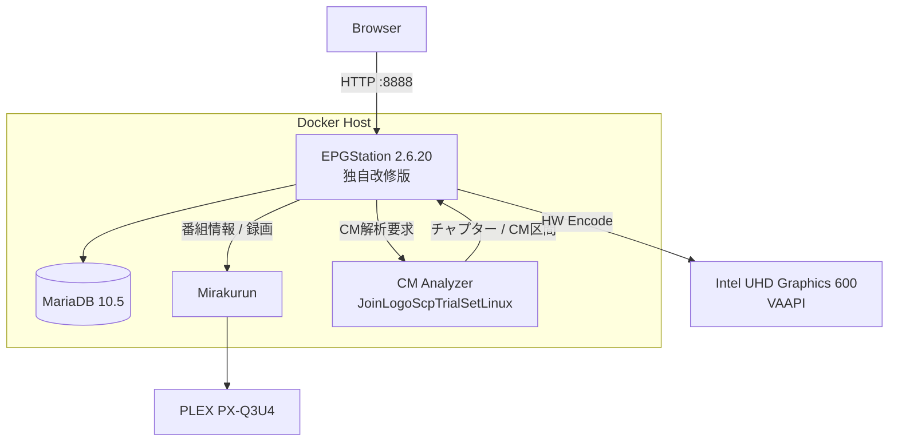
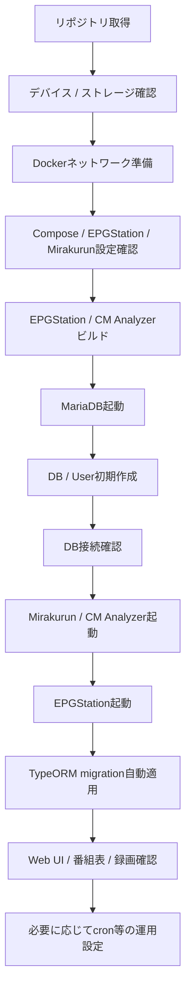
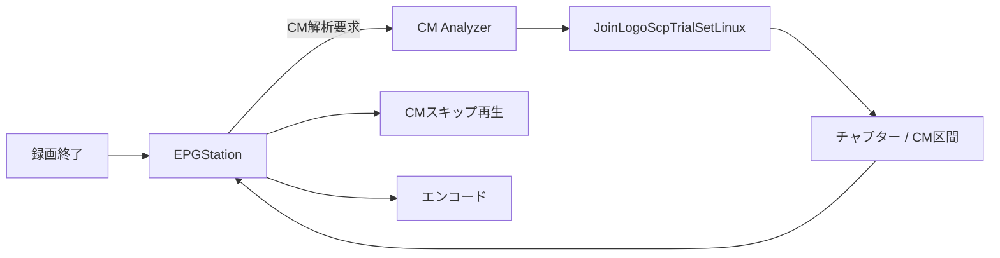
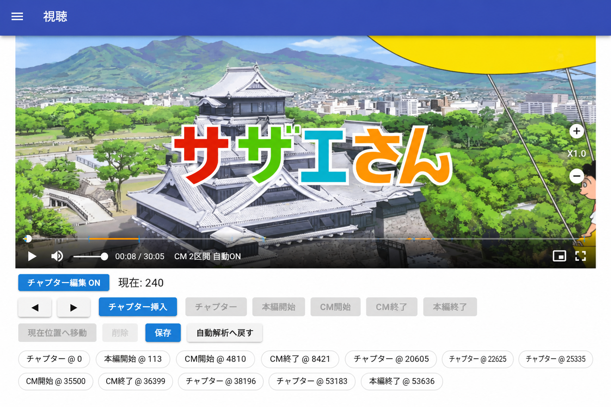
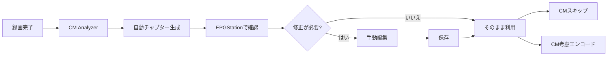
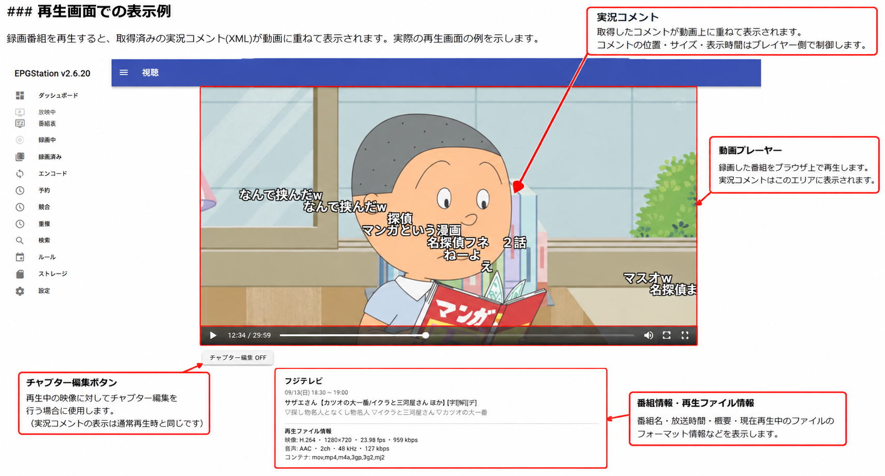
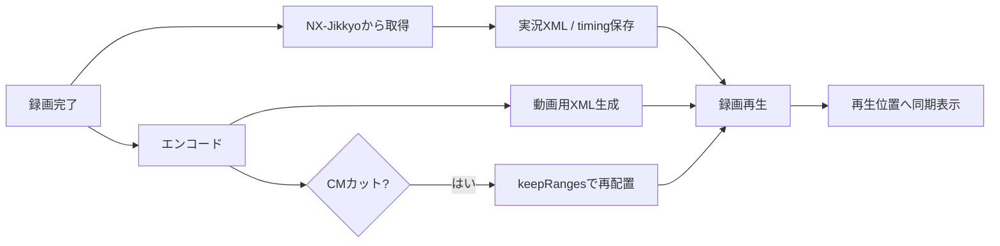

# docker-mirakurun-epgstation

**EPGStation 2.6.20 をベースに独自改修した、自宅録画サーバー用の Mirakurun + EPGStation Docker 環境です。**

本家 EPGStation 2.6.20 のソースコードをベースとしてリポジトリ内で管理・ビルドし、実際の録画サーバーでの運用に合わせて機能追加・改修を行っています。

主な追加・統合機能は、FFmpeg 7.0.2、Intel VAAPI ハードウェアエンコード、TS Repair、CM / チャプター自動解析、CM スキップ、CM 区間を考慮したエンコード、手動チャプター編集、フレームプレビュー、実況コメント取得・再生、本番環境と分離したテスト環境です。

> [!IMPORTANT]
> このリポジトリは EPGStation / Mirakurun の公式配布物ではありません。EPGStation 2.6.20 を基準とした独自派生版であり、本家最新版への自動追従や完全互換を目的としたものではありません。

## ベースバージョン

| Component | Version / Base |
| --- | --- |
| EPGStation | **2.6.20**（独自改修版） |
| FFmpeg | **7.0.2**（ソースビルド + 独自パッチ） |
| Node.js | **16.13.1** |
| MariaDB | **10.5** |
| CM Analyzer | JoinLogoScpTrialSetLinux + 独自パッチ + genlogo |

以降で「EPGStation」と記載している箇所は、特に断りがない限り **EPGStation 2.6.20 ベースの本リポジトリ独自改修版**を指します。

## 主な機能

- Mirakurun によるチューナー管理
- EPGStation 2.6.20 ベースの番組表・予約・録画管理
- MariaDB による EPGStation DB
- FFmpeg 7.0.2 / Intel VAAPI ハードウェアエンコード
- TS タイムライン異常の検出・修復
- JoinLogoScpTrialSetLinux を利用した CM / チャプター解析
- 録画終了後の自動 CM 解析・自動チャプター生成
- CM スキップ再生 / CM 区間を考慮したエンコード
- 手動チャプター編集・フレームプレビュー
- 実況コメントの自動取得・同期再生
- CM カット後の実況コメント位置補正
- 本番環境と独立したテスト環境

## 本家からの経緯

もともとは Mirakurun + EPGStation を Docker 上で動かす録画環境として使用していました。長期間運用する中で、FFmpeg / VAAPI の更新、壊れた TS の救済、CM 自動検出、CM スキップ、CM カットを考慮したエンコード、チャプター編集、実況コメント連携など、設定ファイルや外部スクリプトだけでは収まらない要求が増えました。

そのため現在は EPGStation 2.6.20 のソースコードを `epgstation/source/` に保持し、本体へ独自改修を加えた上で Docker イメージを構築しています。外部の完成済み EPGStation イメージへ依存せず、EPGStation 本体・FFmpeg 7・TS Repair ツールを含めて本リポジトリからビルドする構成です。

## システム構成



Docker Compose では主に `mirakurun`、`mysql-epgstation-v2`、`epgstation-v2`、`cm-analyzer` を動作させます。

## 必要環境

Linux ホストを前提としています。Windows / macOS の Docker Desktop は想定していません。チューナーや `/dev/dri` などの Linux デバイスを直接コンテナへ渡すためです。

- Linux（Debian / Ubuntu 系を想定）
- x86_64 / amd64
- Docker Engine / Docker Compose / Git
- 4 CPU コア以上推奨
- メモリ 8 GB 以上推奨（実機では約 4 GB でも動作）
- 録画用の大容量ストレージ
- TS Repair 用の作業領域

動作確認済み実機では Docker Compose v1 (`docker-compose`) を使用しています。Compose v2 の場合は `docker-compose` を `docker compose` に読み替えてください。

### GPU / VAAPI

現在のエンコードおよびストリーミング構成では Intel GPU の VAAPI を利用します。

```bash
ls -l /dev/dri
```

代表的なデバイスは `/dev/dri/card0` と `/dev/dri/renderD128` です。実機では Intel Gemini Lake / UHD Graphics 600 と Intel iHD driver を使用し、H.264 VAAPI エンコードを確認しています。

### ストレージとホスト側保存先

`docker-compose.yml` / `docker-compose.test.yml` の **ホスト側保存先は環境依存です**。`/media/tv_record` や `/mnt/hdd1/...` は作者の実機例であり、利用者全員が同じ構成にする必要はありません。

| 用途 | 実機例 | コンテナ側 |
| --- | --- | --- |
| 録画データ | `/media/tv_record` | `/app/recorded` / `/recorded` |
| TS Repair 作業領域 | `/mnt/hdd1/ts-repair-work/epgstation-runtime` | `/app/ts-repair-work` |
| EPGStation 設定 | `./epgstation/config` | `/app/config` |
| EPGStation データ | `./epgstation/data` | `/app/data` |
| サムネイル | `./epgstation/thumbnail` | `/app/thumbnail` |
| ログ | `./epgstation/logs` | `/app/logs` |
| CM Analyzer データ | `./epgstation/cm-analyzer-data` | `/data` |
| MariaDB | Docker Volume `mysql-db` | `/var/lib/mysql` |

実機では次の構成です。

```text
/dev/sda1 (ext4 / 7.3 TB)
└── /mnt/hdd1/
    └── record/
         ↑
         └── /media/tv_record -> /mnt/hdd1/record/
```

> [!IMPORTANT]
> 外付けディスク等を bind mount に使う場合は、Docker / EPGStation 起動前に対象ストレージがマウント済みであることを確認してください。未マウントで起動するとルートファイルシステムへ録画・作業データが作成され、容量枯渇につながる場合があります。

## セットアップ

ここからは、**新しいホストへ本環境を構築するときの実行順**に記載します。既存環境を更新する場合は、DB Volume や既存設定を削除・初期化せず、必要な工程だけを実施してください。

### 1. リポジトリを取得

```bash
git clone https://github.com/rucola-salad/docker-mirakurun-epgstation.git
cd docker-mirakurun-epgstation
```

### 2. デバイスとストレージを確認

```bash
ls -l /dev/px4video* 2>/dev/null
ls -l /dev/dri 2>/dev/null
df -h
```

録画先、TS Repair 作業領域、チューナーデバイス、VAAPI デバイスが自環境と一致するよう `docker-compose.yml` を調整します。

### 3. Docker ネットワークを準備

本番 Compose は外部ネットワーク `docker-mirakurun-epgstation_default` を利用します。存在しない場合だけ作成します。

```bash
docker network inspect docker-mirakurun-epgstation_default >/dev/null 2>&1 || \
  docker network create docker-mirakurun-epgstation_default
```

### 4. 設定を確認

特に次を確認してください。

- `docker-compose.yml` の録画先 / TS Repair 作業領域
- `/dev/px4video*` と `/dev/dri`
- `epgstation/config/config.yml` の Mirakurun / DB 設定
- 必要に応じて Mirakurun のチューナー・チャンネル設定

現在の本番設定では EPGStation から MariaDB を `mysql:3306`、DB名・ユーザーとも `epgstation` で参照します。

### 5. EPGStation / CM Analyzer をビルド

`docker-compose.yml` の `image:` と、ここで作成するタグは一致させてください。README の例では Compose 側を `epgstation-v2:local` / `cm-analyzer:local` に変更してからビルドする想定です。

```bash
docker build \
  -f epgstation/ffmpeg7-ts-repair.Dockerfile \
  -t epgstation-v2:local \
  epgstation

docker build \
  -t cm-analyzer:local \
  epgstation/cm-analyzer
```

EPGStation Dockerfile は、FFmpeg 7.0.2 + TS Repair のビルド、EPGStation Server / Client のビルド、Runtime 統合の3段構成です。

> [!IMPORTANT]
> リポジトリの `docker-compose.yml` に作者の運用タグ（例: `epgstation-v2:main-integration-...`、`cm-analyzer:...`）が指定されている場合、そのままでは上記 `:local` を使用しません。自分でビルドする場合は Compose の `image:` をビルドしたタグへ合わせてください。

### 6. MariaDB を初期化

MariaDB だけを先に起動します。

```bash
docker-compose up -d mysql
docker-compose ps mysql
docker-compose logs mysql
```

初回起動時、Compose の環境変数に従って MariaDB が DB とユーザーを作成します。

| 項目 | 現在の設定 |
| --- | --- |
| Database | `epgstation` |
| User | `epgstation` |
| Password | `epgstation` |
| Root password | `epgstation` |
| 永続化 | Docker Volume `mysql-db` |

DB 接続を確認します。

```bash
docker-compose exec mysql \
  mysql -uepgstation -pepgstation epgstation -e 'SELECT 1;'
```

> [!IMPORTANT]
> `mysql-db` が既に存在する場合は既存 DB がそのまま使用されます。既存環境の更新時に Volume を削除して作り直す必要はありません。DB Volume の削除は録画管理情報等の消失につながるため、初期化目的で安易に削除しないでください。

### 7. Mirakurun と CM Analyzer を起動

```bash
docker-compose up -d mirakurun cm-analyzer
docker-compose ps
```

Mirakurun がチューナーを認識し、EPGStation から参照できる状態にします。

### 8. EPGStation を起動してDBマイグレーション

```bash
docker-compose up -d epgstation
docker-compose logs -f epgstation
```

EPGStation の TypeORM 設定は `synchronize: false` / `migrationsRun: true` です。そのためテーブルを手作業で作るのではなく、**EPGStation 起動時に対象 DB へマイグレーションが自動適用**されます。

起動後、テーブルが作成されていることを確認できます。

```bash
docker-compose exec mysql \
  mysql -uepgstation -pepgstation epgstation -e 'SHOW TABLES;'
```

### 9. 全コンテナとWeb UIを確認

```bash
docker-compose ps
docker-compose logs --tail=100 epgstation
```

- EPGStation: `http://<server>:8888/`
- Mirakurun: `http://<server>:40772/`

EPGStation の番組表が取得でき、録画先へ書き込みできることまで確認してください。

### 10. 実況データ cleanup を設定（任意）

実況 XML / timing cache の孤立データを自動整理する場合は `jikkyo-cleanup.sh` を cron から実行します。作者の実機では次を設定しています。

```cron
*/5 * * * * docker exec epgstation-v2 /bin/bash /app/config/jikkyo-cleanup.sh /app/recorded --delete >> /home/tuser/git/docker-mirakurun-epgstation/epgstation/logs/jikkyo-cleanup.log 2>&1
```

ホスト側ログパスは自分の配置に合わせて変更してください。5分は保存期間ではなく cleanup の実行間隔です。

### セットアップの流れ



## 動作確認済み環境

| Item | Environment |
| --- | --- |
| Host | `tuner-server` |
| OS | Ubuntu 22.04 LTS |
| Kernel | `6.5.0-41-generic` |
| CPU | Intel Celeron N4120 / 4 cores / 4 threads |
| Memory | 3.7 GiB RAM + 2.0 GiB Swap |
| GPU | Intel Gemini Lake / UHD Graphics 600 (`8086:3185`) |
| VAAPI device | `/dev/dri/renderD128` |
| Docker | 20.10.21 |
| Docker Compose | 1.29.2 |
| EPGStation | 2.6.20 ベース独自改修版 |
| FFmpeg | 7.0.2 |
| Database | MariaDB 10.5 |
| Tuner | PLEX PX-Q3U4 |
| Tuner driver | `px4_drv` 0.4.2 / DKMS |
| Tuner devices | `/dev/px4video0` ～ `/dev/px4video7` |
| Recording filesystem | `/dev/sda1` / ext4 / 7.3 TB (`/mnt/hdd1`) |
| Recording path | `/media/tv_record` → `/mnt/hdd1/record/` |

## TV チューナー: PLEX PX-Q3U4

動作確認環境では [PLEX PX-Q3U4](https://plex-net.co.jp/item/tv-tuner/px-q3u4/) を使用しています。Linux 用ドライバには [nns779/px4_drv](https://github.com/nns779/px4_drv) を使用し、実機では 0.4.2 を DKMS で導入しています。

## ディレクトリ構成

```text
docker-mirakurun-epgstation/
├── docker-compose.yml
├── docker-compose.test.yml
├── mirakurun/
│   ├── config/
│   ├── data/
│   └── docker/
└── epgstation/
    ├── ffmpeg7-ts-repair.Dockerfile
    ├── source/
    ├── config/
    ├── ts-repair/
    ├── patches/
    ├── cm-analyzer/
    └── test-env/
```

## TS Repair

録画 TS のタイムライン異常などを検出・修復する独自ツール群を EPGStation イメージへ組み込んでいます。主な実行ファイルは `/opt/ffmpeg-7.0.2/bin/` 以下の `ts-repair`、`ts-health-check`、`ts-timeline-remux`、`video-repair`、`audio-repair` です。

## CM Analyzer

CM 解析は EPGStation とは別の Docker コンテナで実行します。JoinLogoScpTrialSetLinux をベースに独自パッチ、CM 解析 API、ロゴ生成処理、`genlogo` を追加しています。



## チャプター編集

CM Analyzer によって自動生成されたチャプター情報を、EPGStation の録画画面から確認・手動補正できます。

### 機能仕様

- 自動解析されたチャプター / CM 区間の確認
- 録画映像を見ながらの境界確認
- 秒単位のシーク / フレーム送り・戻し
- チャプター境界の手動補正・保存
- 保存結果の CM スキップ再生への反映
- 保存結果の CM 区間を考慮したエンコードへの利用

### 画面イメージ



実際のチャプター編集画面では、録画映像の下に編集用 UI が展開されます。`チャプター編集 ON/OFF` で編集モードを切り替え、現在フレームを確認しながら境界位置を補正して保存できます。



## 実況コメント

録画番組に対応する実況コメントを取得して XML として保存し、EPGStation の録画再生時に映像の再生位置へ同期して表示します。元 TS、エンコード動画、CM カット動画に対応します。

### 取得元

実況コメントの取得元には **NX-Jikkyo** を利用しています。

- Service: [NX-Jikkyo](https://jikkyo.tsukumijima.net/)
- 過去ログ API: `https://jikkyo.tsukumijima.net/api/kakolog/<jkId>`
- 取得形式: XML (`format=xml`)
- 取得範囲: `starttime` / `endtime` で録画時間帯を指定

EPGStation のチャンネル情報から実況 ID を決定し、次の形式で過去ログを取得します。

```text
https://jikkyo.tsukumijima.net/api/kakolog/<jkId>?starttime=<開始UNIX時刻>&endtime=<終了UNIX時刻>&format=xml
```

### 取得と保存

録画完了時には `recordingFinishCommand` から `jikkyo-fetch.sh` を自動実行します。実運用では `JIKKYO_AUTO=1` / `JIKKYO_DELAY=600` を指定し、NX-Jikkyo 側へ過去ログが反映されるまで待ってから取得します。

コメントの絶対時刻から動画基準の `vpos`（1/100秒単位）を生成し、動画と同じ basename の XML として保存します。タイミング情報は `/app/data/jikkyo-cache/<recordedId>.timing.json` に保持します。エンコード完了時にも処理を呼び出すため、元 TS を削除してエンコード動画だけを残した場合にも対応できます。

### 再生



録画再生時は動画に対応する XML を読み込み、`vpos` を再生時刻へ対応させてコメントを映像上へ重ねて表示します。シーク時も現在位置に追従します。

CM カット動画では、エンコード時の `keepRanges` とフレームレートの snapshot を使用し、削除された区間のコメントを除外して、残ったコメントをカット後のタイムラインへ再配置します。

### 実況データの自動整理

`jikkyo-cleanup.sh` は、対応するメディアファイルがなくなった XML と、EPGStation API で対応録画 ID が存在しないことを確認できた `/app/data/jikkyo-cache` の孤立データを整理します。`--delete` なしは確認のみ、`--delete` 付きで実削除です。

作者の実機では次の cron を使用しています。

```cron
*/5 * * * * docker exec epgstation-v2 /bin/bash /app/config/jikkyo-cleanup.sh /app/recorded --delete >> /home/tuser/git/docker-mirakurun-epgstation/epgstation/logs/jikkyo-cleanup.log 2>&1
```

> [!NOTE]
> 5分は保存期間ではなく cleanup の実行間隔です。上記ホストパスは作者の実機例です。



## テスト環境

本番 Mirakurun は共有し、EPGStation / MariaDB / CM Analyzer はテスト用として分離します。テスト DB は外部 Docker Volume `epgstation-test-mysql-db` を使うため、初回のみ作成します。

```bash
docker volume create epgstation-test-mysql-db

EPGSTATION_TEST_IMAGE=epgstation-v2:test \
docker-compose -f docker-compose.test.yml up -d

docker-compose -f docker-compose.test.yml ps
```

停止:

```bash
docker-compose -f docker-compose.test.yml down
```

## ディスク容量に関する注意

録画、エンコード、TS Repair、CM Analyzer、Docker イメージビルドでは一時的に大きな領域を使用します。特に Docker `overlay2`、`/tmp`、TS Repair 作業領域、録画 HDD の空き容量に注意してください。

```bash
df -h / /mnt/hdd1
docker system df
```

`/mnt/hdd1` は作者の実機例です。削除を伴うメンテナンスは対象を確認してから行ってください。

## 利用・参照した OSS と謝辞

本プロジェクトは、多くのオープンソースソフトウェア、ライブラリ、先行プロジェクトの成果を利用・参考にして構築しています。

### EPGStation

- Project: [l3tnun/EPGStation](https://github.com/l3tnun/EPGStation)
- License: MIT License
- EPGStation 2.6.20 を録画管理、番組管理、Web UI、ストリーミング、および独自機能追加の基盤として使用しています。

### Mirakurun

- Project: [Chinachu/Mirakurun](https://github.com/Chinachu/Mirakurun)
- License: Apache License 2.0
- チューナー管理、MPEG-TS ストリーム、番組情報の提供に使用しています。

### JoinLogoScpTrialSetLinux

- Project: [tobitti0/JoinLogoScpTrialSetLinux](https://github.com/tobitti0/JoinLogoScpTrialSetLinux)
- CM Analyzer の解析基盤として利用し、本プロジェクトでは独自パッチおよび `genlogo` 等を追加しています。

### FFmpeg

- Project: [FFmpeg](https://ffmpeg.org/)
- Version: 7.0.2
- License: LGPL 2.1+ / GPL 2+（ビルド構成による）
- エンコード、VAAPI、ストリーミング、フレームプレビュー、CM カット、TS 解析・修復に使用しています。

### px4_drv

- Project: [nns779/px4_drv](https://github.com/nns779/px4_drv)
- PLEX PX-Q3U4 を Linux 上で利用するために使用しています。

### その他

本プロジェクトは Node.js、Docker、MariaDB、AviSynth+ をはじめとする多数の OSS とライブラリの上に成り立っています。また、日本のデジタル放送を Linux 上で扱うためのチューナードライバ、ARIB 関連ライブラリ、MPEG-TS 解析技術、録画・CM 解析ツールなど、長年にわたり公開されてきた技術的成果を利用しています。

EPGStation、Mirakurun、JoinLogoScpTrialSetLinux、FFmpeg、px4_drv をはじめ、本プロジェクトが利用・参照しているソフトウェア、ライブラリ、技術情報を開発・公開・維持している開発者およびコントリビューターの皆様に感謝します。

各ソフトウェアの著作権はそれぞれの著作権者に帰属します。利用・再配布にあたっては、本リポジトリだけでなく各ソフトウェア・ライブラリのライセンス条件も確認してください。