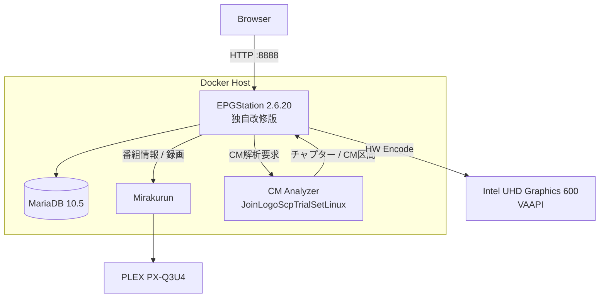
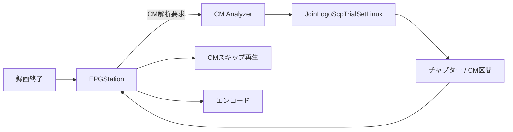
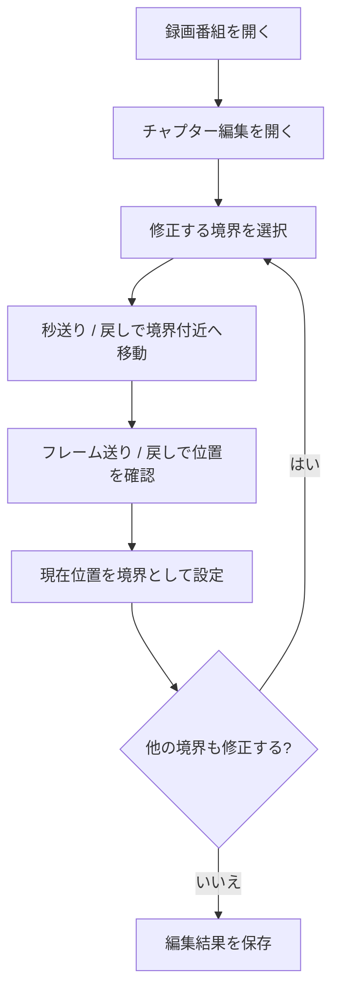
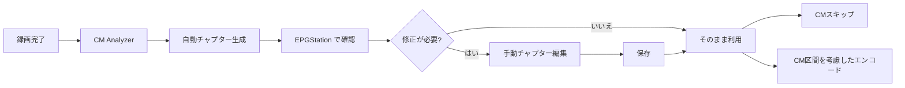
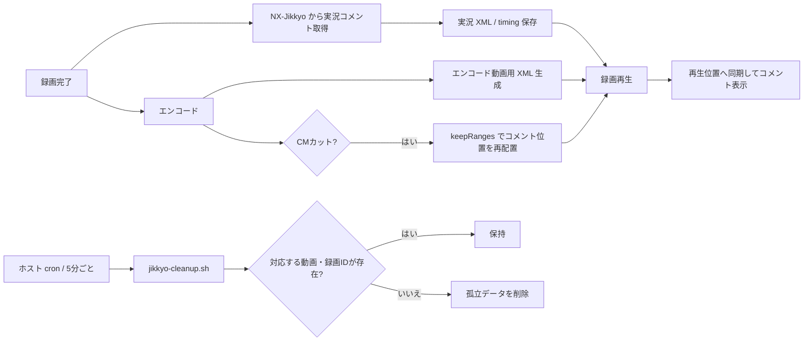
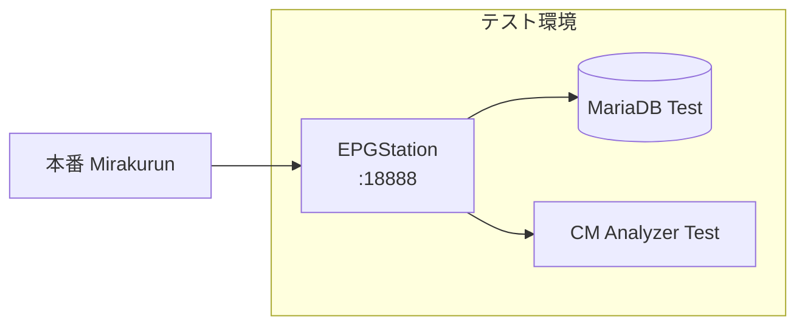

# docker-mirakurun-epgstation

**EPGStation 2.6.20 をベースに独自改修した、自宅録画サーバー用の Mirakurun + EPGStation Docker 環境です。**

本家 EPGStation 2.6.20 のソースコードをベースとしてリポジトリ内で管理・ビルドし、実際の録画サーバーでの運用に合わせて機能追加・改修を行っています。

主な追加・統合機能は、FFmpeg 7.0.2、Intel VAAPI ハードウェアエンコード、TS Repair、CM / チャプター自動解析、CM スキップ、CM 区間を考慮したエンコード、手動チャプター編集、フレームプレビュー、実況コメント取得・再生、本番環境と分離したテスト環境です。

> [!IMPORTANT]
> このリポジトリは EPGStation / Mirakurun の公式配布物ではありません。EPGStation 2.6.20 を基準とした独自派生版であり、本家最新版への自動追従や完全互換を目的としたものではありません。

## ベースバージョン

| Component | Version / Base |
| --- | --- |
| EPGStation | **2.6.20**（独自改修版） |
| FFmpeg | **7.0.2**（ソースビルド + 独自パッチ） |
| Node.js | **16.13.1** |
| MariaDB | **10.5** |
| CM Analyzer | JoinLogoScpTrialSetLinux + 独自パッチ + genlogo |

以降で「EPGStation」と記載している箇所は、特に断りがない限り **EPGStation 2.6.20 ベースの本リポジトリ独自改修版**を指します。

## 主な機能

- Mirakurun によるチューナー管理
- EPGStation 2.6.20 ベースの番組表・予約・録画管理
- MariaDB による EPGStation DB
- FFmpeg 7.0.2
- Intel VAAPI ハードウェアエンコード
- TS タイムライン異常の検出・修復
- JoinLogoScpTrialSetLinux を利用した CM / チャプター解析
- 録画終了後の自動 CM 解析・自動チャプター生成
- CM スキップ再生
- CM 区間を考慮したエンコード
- 手動チャプター編集・フレームプレビュー
- 実況コメントの自動取得・同期再生
- CM カット後の実況コメント位置補正
- 本番環境と独立したテスト環境

## 本家からの経緯

もともとは Mirakurun + EPGStation を Docker 上で動かす録画環境として使用していました。

長期間運用する中で、FFmpeg / VAAPI の更新、壊れた TS の救済、CM 自動検出、CM スキップ、CM カットを考慮したエンコード、チャプター編集、実況コメント連携など、設定ファイルや外部スクリプトだけでは収まらない要求が増えました。

そのため現在は EPGStation 2.6.20 のソースコードを `epgstation/source/` に保持し、本体へ独自改修を加えた上で Docker イメージを構築しています。外部の完成済み EPGStation イメージへ依存せず、EPGStation 本体・FFmpeg 7・TS Repair ツールを含めて本リポジトリからビルドする構成です。

## システム構成



Docker Compose では主に `mirakurun`、`mysql-epgstation-v2`、`epgstation`、`cm-analyzer` を動作させます。

## 必要環境

Linux ホストを前提としています。Windows / macOS の Docker Desktop は想定していません。チューナーや `/dev/dri` などの Linux デバイスを直接コンテナへ渡すためです。

### ホスト

- Linux（Debian / Ubuntu 系を想定）
- x86_64 / amd64
- Docker Engine
- Docker Compose
- Git
- 4 CPU コア以上推奨
- メモリ 8 GB 以上推奨（実機では約 4 GB でも動作していますが、イメージビルドや並列処理の余裕は小さくなります）
- 録画用の大容量ストレージ
- TS Repair 用の作業領域

動作確認済み実機では Docker Compose v1 (`docker-compose`) を使用しています。本 README のコマンド例も実機に合わせて `docker-compose` 形式で記載しています。Compose v2 を利用する場合は `docker-compose` を `docker compose` に読み替えてください。

### GPU / VAAPI

現在のエンコードおよびストリーミング構成では Intel GPU の VAAPI を利用します。代表的なデバイスは `/dev/dri/card0` と `/dev/dri/renderD128` です。

```bash
ls -l /dev/dri
```

Docker イメージには `i965-va-driver-shaders`、`intel-media-va-driver`、`libva2`、`libva-drm2` を組み込んでいます。実機では Intel Gemini Lake / UHD Graphics 600 と Intel iHD driver を使用し、H.264 の VAAPI ハードウェアエンコードを確認しています。

### ストレージとホスト側保存先

`docker-compose.yml` / `docker-compose.test.yml` に記載されている **ホスト側の保存先パスは環境依存です**。このリポジトリに記載されている `/media/tv_record` や `/mnt/hdd1/...` は、本リポジトリ作者の実機構成に合わせた値であり、利用者全員が同じディレクトリ構成にする必要はありません。

利用前に、各 Compose ファイルの bind mount の左辺（`ホスト側パス:コンテナ側パス` のホスト側）を、自分のストレージ構成に合わせて変更してください。特に録画データや TS Repair の作業領域は容量を多く使用するため、十分な空き容量があるファイルシステムを指定してください。

代表的な指定は次のとおりです。

| 用途 | このリポジトリの実機例 | コンテナ側パス | 利用者側での扱い |
| --- | --- | --- | --- |
| 録画データ | `/media/tv_record` | `/app/recorded` / `/recorded` | 録画を保存したい任意の大容量ストレージ上のディレクトリへ変更可 |
| TS Repair 作業領域 | `/mnt/hdd1/ts-repair-work/epgstation-runtime` | `/app/ts-repair-work` | 十分な一時作業容量を確保できる任意のディレクトリへ変更可 |
| EPGStation 設定 | `./epgstation/config` | `/app/config` | 通常はリポジトリ内の相対パスをそのまま利用 |
| EPGStation データ | `./epgstation/data` | `/app/data` | 必要に応じて永続化先を変更可 |
| サムネイル | `./epgstation/thumbnail` | `/app/thumbnail` | 必要に応じて永続化先を変更可 |
| EPGStation ログ | `./epgstation/logs` | `/app/logs` | 必要に応じて永続化先を変更可 |
| CM Analyzer データ | `./epgstation/cm-analyzer-data` | `/data` | 必要に応じて永続化先を変更可 |
| MariaDB | Docker Volume `mysql-db` | `/var/lib/mysql` | 通常は Docker Volume を利用 |

例えば、録画用ディスクを `/srv/recording` にマウントしている環境なら、Compose の録画 bind mount を次のように変更できます。

```yaml
volumes:
  - /srv/recording:/app/recorded
```

CM Analyzer からも同じ録画データを参照するため、そちらのホスト側パスも同じ実体を指すようにします。

```yaml
volumes:
  - /srv/recording:/recorded:ro
```

#### 本リポジトリ作者の実機例

実機では外付け録画用 HDD `/dev/sda1` を `/mnt/hdd1` にマウントし、その配下の `/mnt/hdd1/record/` を録画データの実体保存先としています。Compose から参照する `/media/tv_record` は、そこを指すシンボリックリンクです。

```text
/dev/sda1 (ext4 / 7.3 TB)
└── /mnt/hdd1/
    └── record/
         ↑
         └── /media/tv_record -> /mnt/hdd1/record/
```

この構成はあくまで**動作確認済み実機の一例**です。別のマウントポイント、内蔵ディスク、NAS 等を利用する場合は、それぞれの環境に適したホスト側パスを指定してください。

> [!IMPORTANT]
> 外付けディスクや別ファイルシステムを bind mount の保存先として利用する場合は、Docker / EPGStation を起動する前に対象ストレージが正しくマウントされていることを確認してください。未マウントのまま起動すると、本来の保存先ではなくホストのルートファイルシステム側へディレクトリやデータが作成され、容量枯渇につながる場合があります。

## 動作確認済み環境

実際に本リポジトリを運用している `tuner-server` の主要構成です。

| Item | Environment |
| --- | --- |
| Host | `tuner-server` |
| OS | Ubuntu 22.04 LTS (Jammy Jellyfish) |
| Kernel | `6.5.0-41-generic` |
| Architecture | x86_64 |
| CPU | Intel Celeron N4120 @ 1.10 GHz / 4 cores / 4 threads |
| Memory | 3.7 GiB RAM + 2.0 GiB Swap |
| GPU | Intel Gemini Lake / UHD Graphics 600 (`8086:3185`) |
| VA-API | 1.14 (libva 2.12.0) |
| VAAPI driver | Intel iHD driver 22.3.1 |
| VAAPI device | `/dev/dri/renderD128` |
| Docker | 20.10.21 |
| Docker Compose | 1.29.2 (`/usr/bin/docker-compose`) |
| EPGStation | 2.6.20 ベース独自改修版 |
| FFmpeg | 7.0.2 / source build |
| Database | MariaDB 10.5 |
| Tuner | PLEX PX-Q3U4 |
| Tuner USB ID | `0511:084a` |
| Tuner driver | `px4_drv` 0.4.2 / DKMS |
| Tuner devices | `/dev/px4video0` ～ `/dev/px4video7` |
| System filesystem | `/dev/mmcblk1p2` / ext4 / 56 GB |
| Recording / work filesystem | `/dev/sda1` / ext4 / 7.3 TB (`/mnt/hdd1`) |
| Recording path | `/media/tv_record` → `/mnt/hdd1/record/` (symlink) |
| CM Analyzer | JoinLogoScpTrialSetLinux + patches + genlogo |

> [!NOTE]
> 上記は最低要件ではなく、現在実際に動作確認している環境です。メモリ容量やストレージ構成は用途・ビルド方法・同時処理数に応じて余裕を持たせてください。

## TV チューナー: PLEX PX-Q3U4

動作確認環境では [PLEX PX-Q3U4](https://plex-net.co.jp/item/tv-tuner/px-q3u4/) を使用しています。USB 接続の外付けデジタル TV チューナーで、地上デジタル 4ch + BS/CS 4ch の構成です。

Linux 用ドライバには [nns779/px4_drv](https://github.com/nns779/px4_drv) を使用しています。実機では `px4_drv` 0.4.2 を DKMS で導入しており、Kernel `6.5.0-41-generic` 用モジュールとしてロードされています。PX-Q3U4 では `/dev/px4video0` ～ `/dev/px4video7` の8デバイスを使用しています。

> [!NOTE]
> `px4_drv` は非公式 Linux ドライバです。Linux カーネルのバージョンや使用するドライバの版によって導入方法・対応状況が異なる場合があります。

## ディレクトリ構成

```text
docker-mirakurun-epgstation/
├── docker-compose.yml
├── docker-compose.test.yml
├── mirakurun/
│   ├── config/
│   ├── data/
│   └── docker/
└── epgstation/
    ├── ffmpeg7-ts-repair.Dockerfile
    ├── source/
    ├── config/
    ├── ts-repair/
    ├── patches/
    ├── cm-analyzer/
    └── test-env/
```

## EPGStation イメージのビルド

```bash
docker build \
  -f epgstation/ffmpeg7-ts-repair.Dockerfile \
  -t epgstation-v2:local \
  epgstation
```

Dockerfile は大きく3段構成です。

1. Debian 11 ベースで FFmpeg 7.0.2、VAAPI パッチ、TS Repair ツールをビルド
2. Node.js 16.13.1 ベースで EPGStation 2.6.20 の Server / Client をビルド
3. Runtime イメージへ EPGStation、FFmpeg 7、VAAPI、TS Repair を統合

## TS Repair

録画 TS のタイムライン異常などを検出・修復する独自ツール群を EPGStation イメージへ組み込んでいます。主な実行ファイルは `/opt/ffmpeg-7.0.2/bin/` 以下の `ts-repair`、`ts-health-check`、`ts-timeline-remux`、`video-repair`、`audio-repair` です。

## CM Analyzer

CM 解析は EPGStation とは別の Docker コンテナで実行します。JoinLogoScpTrialSetLinux をベースに独自パッチ、CM 解析 API、ロゴ生成処理、`genlogo` を追加しています。



### CM Analyzer のビルド

```bash
docker build \
  -t cm-analyzer:local \
  epgstation/cm-analyzer
```

## チャプター編集

CM Analyzer によって自動生成されたチャプター情報を、EPGStation の録画画面から確認・手動補正できます。自動解析を基本とし、CM 開始・終了位置のずれや誤判定がある箇所だけを人間が補正する運用を想定しています。

### 機能仕様

- 自動解析されたチャプター / CM 区間の確認
- 録画映像を見ながらの境界確認
- 秒単位のシークによる大まかな位置合わせ
- フレーム送り / 戻しによる境界位置の微調整
- チャプター位置への移動
- チャプター境界の手動補正
- 編集したチャプター情報の保存
- 保存したチャプター情報を CM スキップ再生へ反映
- 保存したチャプター情報を CM 区間を考慮したエンコードへ利用

### 画面イメージ


実際のチャプター編集画面では、録画映像の下に編集用UIが展開されます。`チャプター編集 ON/OFF` で編集モードを切り替え、現在フレームを確認しながら前後フレーム移動や秒単位の移動を使って境界位置を合わせます。チャプター挿入や、本編開始・CM開始・CM終了・本編終了などの区分を選択して境界を補正し、編集結果を保存できます。下段のチャプター位置ボタンから既存境界へ移動して確認することもできます。

### 基本操作



CM 開始・終了位置を厳密に合わせる場合は、まず秒単位で境界付近へ移動し、その後フレーム単位で映像を確認して境界を決定します。フレーム番号だけでなく、プレビュー映像を確認しながら調整することを前提としています。

### 自動解析との関係



チャプター編集は自動 CM 解析を置き換えるものではなく、**自動解析結果を人間が必要に応じて補正する機能**として位置付けています。

## 実況コメント

録画番組に対応する実況コメントを取得して XML として保存し、EPGStation の録画再生時に映像の再生位置へ同期して表示できるようにしています。元 TS だけでなく、エンコード後の動画や CM カットした動画でも実況コメントを利用できるよう、録画時刻・動画タイムラインとの対応を保持・変換します。

### 取得元

実況コメントの取得元には **NX-Jikkyo** を利用しています。

- Service: [NX-Jikkyo](https://jikkyo.tsukumijima.net/)
- 過去ログ API: `https://jikkyo.tsukumijima.net/api/kakolog/<jkId>`
- 取得形式: XML (`format=xml`)
- 取得範囲: 録画の開始・終了時刻に合わせて `starttime` / `endtime` を指定

EPGStation のチャンネル情報から放送局に対応する実況 ID（`jk1`、`jk4`、`jk8` など）を決定し、NX-Jikkyo の過去ログ API から対象時間帯のコメントを取得します。実装では例えば次の形式でアクセスします。

```text
https://jikkyo.tsukumijima.net/api/kakolog/<jkId>?starttime=<開始UNIX時刻>&endtime=<終了UNIX時刻>&format=xml
```

### 取得と保存

録画完了時には `recordingFinishCommand` から `jikkyo-fetch.sh` を自動実行します。実運用では `JIKKYO_AUTO=1` と `JIKKYO_DELAY=600` を指定し、録画終了後にNX-Jikkyo側へ過去ログが反映されるまで待ってから取得します。拡張設定で実況 XML の自動生成を無効にした場合は、この自動実行をスキップできます。

`jikkyo-fetch.sh` は取得した各コメントの絶対時刻から、録画動画の基準時刻 `baseTime` を使って `vpos`（1/100 秒単位）を生成し、動画と同じ basename の XML として保存します。

タイミング情報は `/app/data/jikkyo-cache/<recordedId>.timing.json` に保存します。TS が残っている場合は `ffprobe` で取得した動画長と TS ファイルの更新時刻から実録画時間を算出し、その時間帯をNX-Jikkyoへの取得範囲に使用します。TS がない場合でも保存済みタイミング情報や録画番組の時刻情報を利用して実況 XML を再生成できる構成です。

エンコード完了時にも実況取得処理を呼び出し、生成された動画に対応する実況 XML を用意します。これにより、元 TS を削除してエンコード動画だけを残した録画でも、対応する実況 XML があればコメント付きで再生できます。

### 再生


録画再生時は、動画に対応する実況 XML を読み込み、XML 内の `vpos` を動画の再生時刻へ対応させてコメントを動画上へ重ねて表示します。上の実画面では、映像上を横方向に流れている白文字が取得済みの実況コメントです。シークした場合も現在の再生位置に応じてコメント表示が追従します。

通常の TS とエンコード済み動画の双方で同期再生できるよう、コメントデータと動画のタイムラインを分離して保持しています。

CM カット動画では、単純に元動画と同じ `vpos` を使用すると削除された CM 区間の分だけコメント位置がずれるため、エンコード時に実際に使用した `keepRanges` とフレームレートをタイムライン snapshot として保持します。実況 XML 生成時には、削除された区間のコメントを除外し、残された区間のコメント位置を CM カット後の連続したタイムラインへ詰め直します。後からチャプターを手動編集しても、実際にその動画を生成した時点の snapshot を使うことで位置関係を維持します。

### 実況データの自動整理

実況 XML やタイミングキャッシュが、対応する録画を削除した後も残り続けないよう `jikkyo-cleanup.sh` を用意しています。

録画フォルダでは、XML と同じ basename を持つ動画などの実ファイルが存在する限り XML を保持し、対応するメディアファイルがなくなった XML だけを孤立データとして扱います。また `/app/data/jikkyo-cache` の `<recordedId>.xml` と `<recordedId>.timing.json` は、EPGStation API で対応する録画 ID が存在しないことを確認した場合に孤立キャッシュとして扱います。

`--delete` を付けずに実行すると対象確認のみ、`--delete` を指定すると実際に孤立データを削除します。

動作確認済み実機では、ホスト側 cron から5分ごとに cleanup を実行しています。

```cron
*/5 * * * * docker exec epgstation-v2 /bin/bash /app/config/jikkyo-cleanup.sh /app/recorded --delete >> /home/tuser/git/docker-mirakurun-epgstation/epgstation/logs/jikkyo-cleanup.log 2>&1
```

> [!NOTE]
> 5分は実況 XML の保存期間ではなく、cleanup の**実行間隔**です。対応する動画・録画情報が存在する実況データは削除しません。また、上記 `/home/tuser/git/docker-mirakurun-epgstation/...` は本リポジトリ作者の実機パスなので、他の環境ではリポジトリやログの配置に合わせて変更してください。

実況コメント機能の概略は次のとおりです。



## 本番環境の起動

```bash
docker-compose up -d
docker-compose ps
docker-compose logs -f
```

- EPGStation: `http://<server>:8888/`
- Mirakurun: `http://<server>:40772/`

## テスト環境

本番へ変更を反映する前に確認できるよう、`docker-compose.test.yml` に独立した EPGStation テスト環境を用意しています。本番 Mirakurun は共有し、EPGStation / MariaDB / CM Analyzer はテスト用として分離します。



テスト設定は `epgstation/test-env/config/` に Git 管理されています。テスト DB は外部 Docker Volume `epgstation-test-mysql-db` を使用するため、初回のみ作成します。

```bash
docker volume create epgstation-test-mysql-db
```

起動例:

```bash
EPGSTATION_TEST_IMAGE=epgstation-v2:test \
docker-compose -f docker-compose.test.yml up -d

docker-compose -f docker-compose.test.yml ps
```

停止:

```bash
docker-compose -f docker-compose.test.yml down
```

## ディスク容量に関する注意

録画、エンコード、TS Repair、CM Analyzer、Docker イメージビルドでは一時的に大きなディスク領域を使用することがあります。特にシステム領域の Docker `overlay2`、`/tmp`、TS Repair 作業領域、録画 HDD の空き容量に注意してください。

```bash
df -h / /mnt/hdd1
docker system df
```

上記の `/mnt/hdd1` は本リポジトリ作者の実機例です。別の保存先を使用する場合は、自分の録画・作業領域のマウントポイントに読み替えて確認してください。

不要な Docker イメージや録画データを自動的に削除する運用にはしていません。削除を伴うメンテナンスは、対象を確認してから手動で行うことを推奨します。

## 利用・参照した OSS と謝辞

本プロジェクトは、多くのオープンソースソフトウェア、ライブラリ、先行プロジェクトの成果を利用・参考にして構築しています。

### EPGStation

- Project: [l3tnun/EPGStation](https://github.com/l3tnun/EPGStation)
- License: MIT License
- EPGStation 2.6.20 を録画管理、番組管理、Web UI、ストリーミング、および独自機能追加の基盤として使用しています。

### Mirakurun

- Project: [Chinachu/Mirakurun](https://github.com/Chinachu/Mirakurun)
- License: Apache License 2.0
- チューナー管理、MPEG-TS ストリーム、番組情報の提供に使用しています。

### JoinLogoScpTrialSetLinux

- Project: [tobitti0/JoinLogoScpTrialSetLinux](https://github.com/tobitti0/JoinLogoScpTrialSetLinux)
- CM Analyzer の解析基盤として `chapter_exe`、`logoframe`、`join_logo_scp` などを利用しています。
- 本プロジェクトでは独自パッチおよび `genlogo` 等の補助機能を追加しています。
- 各コンポーネントの著作権・ライセンスについては、それぞれの配布元の表記も参照してください。

### FFmpeg

- Project: [FFmpeg](https://ffmpeg.org/)
- Version: 7.0.2
- License: LGPL 2.1+ / GPL 2+（ビルド構成による）
- エンコード、VAAPI、ストリーミング、フレームプレビュー、CM カット、TS 解析・修復処理に使用しています。

### px4_drv

- Project: [nns779/px4_drv](https://github.com/nns779/px4_drv)
- PLEX PX-Q3U4 を Linux 上で利用するために使用しています。
- 実機では 0.4.2 を DKMS で導入しています。

### その他

本プロジェクトは Node.js、Docker、MariaDB、AviSynth+ をはじめとする多数の OSS とライブラリの上に成り立っています。また、日本のデジタル放送を Linux 上で扱うためのチューナードライバ、ARIB 関連ライブラリ、MPEG-TS 解析技術、録画・CM 解析ツールなど、長年にわたり公開されてきた技術的成果を利用しています。

EPGStation、Mirakurun、JoinLogoScpTrialSetLinux、FFmpeg、px4_drv をはじめ、本プロジェクトが利用・参照しているソフトウェア、ライブラリ、技術情報を開発・公開・維持している開発者およびコントリビューターの皆様に感謝します。本リポジトリで独自に実装した機能も、これらの先行プロジェクトと公開された技術的成果を基盤としています。

各ソフトウェアの著作権はそれぞれの著作権者に帰属します。利用・再配布にあたっては、本リポジトリだけでなく各ソフトウェア・ライブラリのライセンス条件も確認してください。