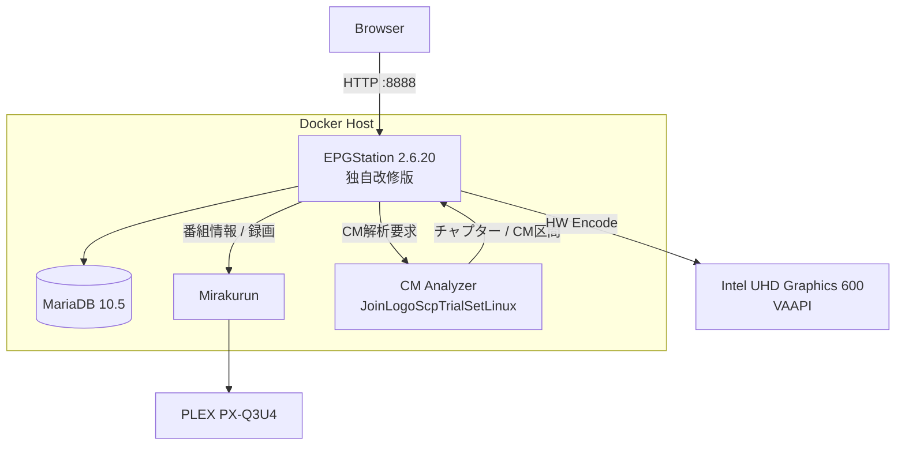
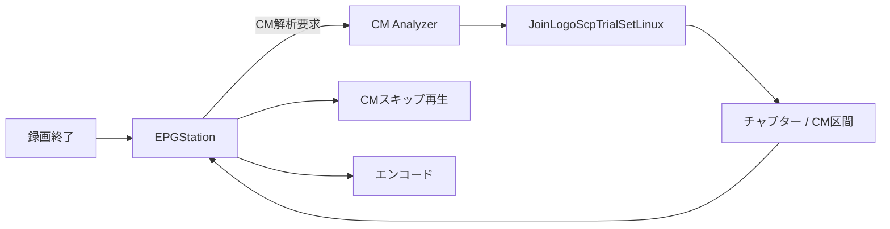
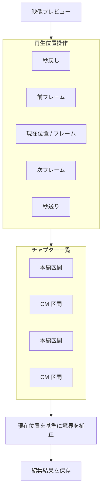
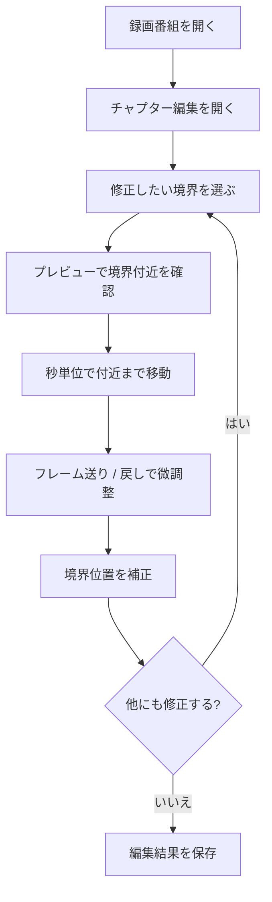
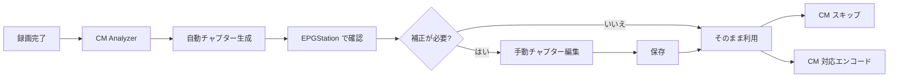
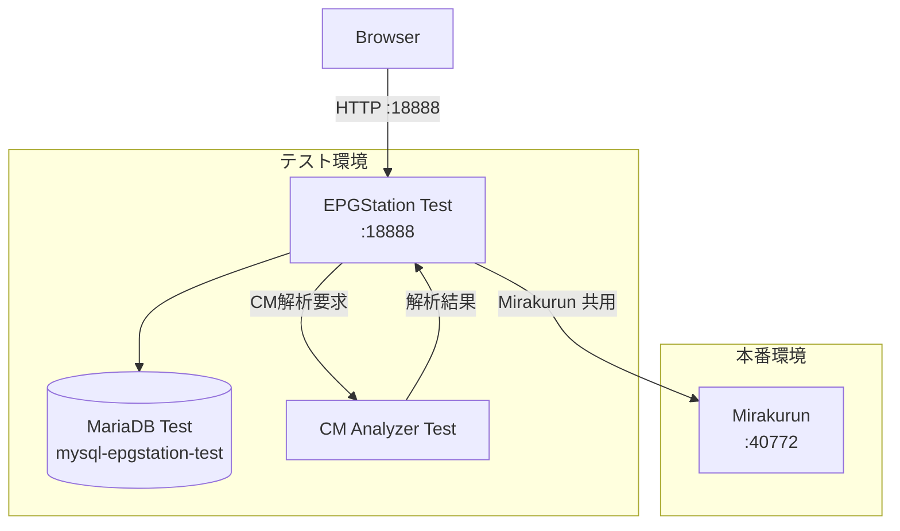

# docker-mirakurun-epgstation

**EPGStation 2.6.20 をベースに独自改修した、自宅録画サーバー用の Mirakurun + EPGStation Docker 環境です。**

本家 EPGStation 2.6.20 のソースコードをベースとしてリポジトリ内で管理・ビルドし、実際の録画サーバーでの運用に合わせて機能追加・改修を行っています。

主な追加・統合機能は、FFmpeg 7.0.2、Intel VAAPI ハードウェアエンコード、TS Repair、CM / チャプター自動解析、CM スキップ、CM 区間を考慮したエンコード、手動チャプター編集、フレームプレビュー、実況コメント取得、本番環境と分離したテスト環境です。

> [!IMPORTANT]
> このリポジトリは EPGStation / Mirakurun の公式配布物ではありません。EPGStation 2.6.20 を基準とした独自派生版であり、本家最新版への自動追従や完全互換を目的としたものではありません。

## ベースバージョン

| Component | Version / Base |
| --- | --- |
| EPGStation | **2.6.20**（独自改修版） |
| FFmpeg | **7.0.2**（ソースビルド + 独自パッチ） |
| Node.js | **16.13.1** |
| MariaDB | **10.5** |
| CM Analyzer | JoinLogoScpTrialSetLinux + 独自パッチ + genlogo |

以降で「EPGStation」と記載している箇所は、特に断りがない限り **EPGStation 2.6.20 ベースの本リポジトリ独自改修版**を指します。

## 主な機能

- Mirakurun によるチューナー管理
- EPGStation 2.6.20 ベースの番組表・予約・録画管理
- MariaDB による EPGStation DB
- FFmpeg 7.0.2
- Intel VAAPI ハードウェアエンコード
- TS タイムライン異常の検出・修復
- JoinLogoScpTrialSetLinux を利用した CM / チャプター解析
- 録画終了後の自動 CM 解析・自動チャプター生成
- CM スキップ再生
- CM 区間を考慮したエンコード
- 手動チャプター編集・フレームプレビュー
- 実況コメント取得
- 本番環境と独立したテスト環境

## 本家からの経緯

もともとは Mirakurun + EPGStation を Docker 上で動かす録画環境として使用していました。

長期間運用する中で、FFmpeg / VAAPI の更新、壊れた TS の救済、CM 自動検出、CM スキップ、CM カットを考慮したエンコード、チャプター編集、実況コメント連携など、設定ファイルや外部スクリプトだけでは収まらない要求が増えました。

そのため現在は EPGStation 2.6.20 のソースコードを `epgstation/source/` に保持し、本体へ独自改修を加えた上で Docker イメージを構築しています。外部の完成済み EPGStation イメージへ依存せず、EPGStation 本体・FFmpeg 7・TS Repair ツールを含めて本リポジトリからビルドする構成です。

## システム構成



Docker Compose では主に `mirakurun`、`mysql-epgstation-v2`、`epgstation`、`cm-analyzer` を動作させます。

## 必要環境

Linux ホストを前提としています。Windows / macOS の Docker Desktop は想定していません。チューナーや `/dev/dri` などの Linux デバイスを直接コンテナへ渡すためです。

### ホスト

- Linux（Debian / Ubuntu 系を想定）
- x86_64 / amd64
- Docker Engine
- Docker Compose
- Git
- 4 CPU コア以上推奨
- メモリ 8 GB 以上推奨（実機では約 4 GB でも動作していますが、イメージビルドや並列処理の余裕は小さくなります）
- 録画用の大容量ストレージ
- TS Repair 用の作業領域

動作確認済み実機では Docker Compose v1 (`docker-compose`) を使用しています。本 README のコマンド例も実機に合わせて `docker-compose` 形式で記載しています。Compose v2 を利用する場合は `docker-compose` を `docker compose` に読み替えてください。

### GPU / VAAPI

現在のエンコードおよびストリーミング構成では Intel GPU の VAAPI を利用します。代表的なデバイスは `/dev/dri/card0` と `/dev/dri/renderD128` です。

```bash
ls -l /dev/dri
```

Docker イメージには `i965-va-driver-shaders`、`intel-media-va-driver`、`libva2`、`libva-drm2` を組み込んでいます。実機では Intel Gemini Lake / UHD Graphics 600 と Intel iHD driver を使用し、H.264 の VAAPI ハードウェアエンコードを確認しています。

### ストレージ

現在の Compose には次の実環境用パスがあります。

- 録画: `/media/tv_record`
- TS Repair 作業領域: `/mnt/hdd1/ts-repair-work/epgstation-runtime`

別環境で利用する場合は `docker-compose.yml` / `docker-compose.test.yml` のマウント先を変更してください。

## 動作確認済み環境

実際に本リポジトリを運用している `tuner-server` の主要構成です。

| Item | Environment |
| --- | --- |
| Host | `tuner-server` |
| OS | Ubuntu 22.04 LTS (Jammy Jellyfish) |
| Kernel | `6.5.0-41-generic` |
| Architecture | x86_64 |
| CPU | Intel Celeron N4120 @ 1.10 GHz / 4 cores / 4 threads |
| Memory | 3.7 GiB RAM + 2.0 GiB Swap |
| GPU | Intel Gemini Lake / UHD Graphics 600 (`8086:3185`) |
| VA-API | 1.14 (libva 2.12.0) |
| VAAPI driver | Intel iHD driver 22.3.1 |
| VAAPI device | `/dev/dri/renderD128` |
| Docker | 20.10.21 |
| Docker Compose | 1.29.2 (`/usr/bin/docker-compose`) |
| EPGStation | 2.6.20 ベース独自改修版 |
| FFmpeg | 7.0.2 / source build |
| Database | MariaDB 10.5 |
| Tuner | PLEX PX-Q3U4 |
| Tuner USB ID | `0511:084a` |
| Tuner driver | `px4_drv` 0.4.2 / DKMS |
| Tuner devices | `/dev/px4video0` ～ `/dev/px4video7` |
| System filesystem | `/dev/mmcblk1p2` / ext4 / 56 GB |
| Recording / work filesystem | `/dev/sda1` / ext4 / 7.3 TB (`/mnt/hdd1`) |
| CM Analyzer | JoinLogoScpTrialSetLinux + patches + genlogo |

> [!NOTE]
> 上記は最低要件ではなく、現在実際に動作確認している環境です。メモリ容量やストレージ構成は用途・ビルド方法・同時処理数に応じて余裕を持たせてください。

## TV チューナー: PLEX PX-Q3U4

動作確認環境では [PLEX PX-Q3U4](https://plex-net.co.jp/item/tv-tuner/px-q3u4/) を使用しています。USB 接続の外付けデジタル TV チューナーで、地上デジタル 4ch + BS/CS 4ch の構成です。

Linux 用ドライバには [nns779/px4_drv](https://github.com/nns779/px4_drv) を使用しています。実機では `px4_drv` 0.4.2 を DKMS で導入しており、Kernel `6.5.0-41-generic` 用モジュールとしてロードされています。PX-Q3U4 では `/dev/px4video0` ～ `/dev/px4video7` の8デバイスを使用しています。

> [!NOTE]
> `px4_drv` は非公式 Linux ドライバです。Linux カーネルのバージョンや使用するドライバの版によって導入方法・対応状況が異なる場合があります。

## ディレクトリ構成

```text
docker-mirakurun-epgstation/
├── docker-compose.yml
├── docker-compose.test.yml
├── mirakurun/
│   ├── config/
│   ├── data/
│   └── docker/
└── epgstation/
    ├── ffmpeg7-ts-repair.Dockerfile
    ├── source/
    ├── config/
    ├── ts-repair/
    ├── patches/
    ├── cm-analyzer/
    └── test-env/
```

## EPGStation イメージのビルド

```bash
docker build \
  -f epgstation/ffmpeg7-ts-repair.Dockerfile \
  -t epgstation-v2:local \
  epgstation
```

Dockerfile は大きく3段構成です。

1. Debian 11 ベースで FFmpeg 7.0.2、VAAPI パッチ、TS Repair ツールをビルド
2. Node.js 16.13.1 ベースで EPGStation 2.6.20 の Server / Client をビルド
3. Runtime イメージへ EPGStation、FFmpeg 7、VAAPI、TS Repair を統合

## TS Repair

録画 TS のタイムライン異常などを検出・修復する独自ツール群を EPGStation イメージへ組み込んでいます。主な実行ファイルは `/opt/ffmpeg-7.0.2/bin/` 以下の `ts-repair`、`ts-health-check`、`ts-timeline-remux`、`video-repair`、`audio-repair` です。

## CM Analyzer

CM 解析は EPGStation とは別の Docker コンテナで実行します。JoinLogoScpTrialSetLinux をベースに独自パッチ、CM 解析 API、ロゴ生成処理、`genlogo` を追加しています。



### CM Analyzer のビルド

```bash
docker build \
  -t cm-analyzer:local \
  epgstation/cm-analyzer
```

## チャプター編集

CM Analyzer によって自動生成されたチャプター情報を、EPGStation の録画画面から確認・手動補正できます。自動解析を基本とし、CM 開始・終了位置のずれや誤判定がある箇所だけを人間が補正する運用を想定しています。

### 機能仕様

- 自動解析されたチャプター / CM 区間の確認
- 録画映像を見ながらの境界確認
- 秒単位のシークによる大まかな位置合わせ
- フレーム送り / 戻しによる境界位置の微調整
- チャプター位置への移動
- チャプター境界の手動補正
- 編集したチャプター情報の保存
- 保存したチャプター情報を CM スキップ再生へ反映
- 保存したチャプター情報を CM 区間を考慮したエンコードへ利用

> [!NOTE]
> 下図は操作概念を説明するための模式図です。実際の EPGStation UI のスクリーンショットを厳密に再現したものではありません。

### 画面イメージ



### 基本操作



CM 開始・終了位置を正確に合わせる場合は、最初からフレーム単位で長距離を移動するのではなく、まず秒単位の操作で境界付近まで移動し、その後フレーム送り / 戻しで位置を絞り込むのが基本です。

### 自動解析と手動補正



チャプター編集は CM Analyzer を置き換える機能ではなく、**自動解析結果を人間が補正するための機能**です。通常は自動解析結果を利用し、CM 境界のずれ、番組冒頭・末尾の誤判定、提供表示や番宣などを意図的に残したい場合に手動編集します。

フレームプレビューは確認位置に応じて映像を取得するため、連続操作時にはプレビュー更新に時間がかかる場合があります。また、元の放送 TS に PTS / DTS の不整合や欠損がある場合は、境界編集以前に TS Repair が必要になることがあります。

## 本番環境の起動

```bash
docker-compose up -d
docker-compose ps
```

ログ確認:

```bash
docker-compose logs -f
```

- EPGStation: `http://<server>:8888/`
- Mirakurun: `http://<server>:40772/`

## テスト環境

本番へ変更を反映する前に確認できるよう、`docker-compose.test.yml` に独立した EPGStation テスト環境を用意しています。EPGStation、MariaDB、設定・データ、録画ファイル、サムネイル、ログ、CM Analyzer / CM 解析データは本番と分離し、Mirakurun は本番環境と共有します。



テスト用設定は `epgstation/test-env/config/` に Git 管理されているため、初回起動時に本番設定をコピーする必要はありません。

### テスト用イメージのビルド

```bash
docker build \
  -f epgstation/ffmpeg7-ts-repair.Dockerfile \
  -t epgstation-v2:test \
  epgstation
```

### テスト環境の起動

```bash
EPGSTATION_TEST_IMAGE=epgstation-v2:test \
  docker-compose -f docker-compose.test.yml up -d
```

テスト環境は `http://<server>:18888/` で確認します。

> [!WARNING]
> テスト DB を初期化する操作は保存データを削除します。必要なデータがないことを確認してから実施してください。通常の起動・再起動では DB の初期化は不要です。

## 開発・テスト・本番反映


本番へ直接変更を入れるのではなく、原則としてテスト環境で確認してから本番へ反映します。

## ディスク容量について

録画サーバーでは、録画データだけでなくエンコード中間ファイル、TS Repair 作業ファイル、Docker イメージ / build cache / overlay2 なども容量を消費します。

```bash
df -h
docker system df
```

特に `/`、`/var/lib/docker`、`/media/tv_record`、`/mnt/hdd1` の空き容量を確認してください。`docker system prune` などの削除操作は、必要なイメージ・キャッシュ・コンテナを消す可能性があるため、内容を確認せず実行しないでください。

## 利用・参照した OSS と謝辞

本プロジェクトは、多くのオープンソースソフトウェア、ライブラリ、先行プロジェクトの成果を利用・参考にして構築しています。これらを開発・公開し、長年にわたり維持されている開発者・コントリビューターの皆様に深く感謝いたします。

### EPGStation

- Project: [l3tnun/EPGStation](https://github.com/l3tnun/EPGStation)
- License: MIT License
- 利用箇所: 録画管理、番組管理、Web UI、ストリーミング、および本リポジトリ独自機能の実装基盤

本プロジェクトの中心となる録画管理システムは EPGStation 2.6.20 を基盤としています。優れた録画管理ソフトウェアを公開されている l3tnun 氏、および EPGStation の開発に携わるすべてのコントリビューターの皆様に深く感謝いたします。

### Mirakurun

- Project: [Chinachu/Mirakurun](https://github.com/Chinachu/Mirakurun)
- License: Apache License 2.0
- 利用箇所: Linux 上のテレビチューナー管理、MPEG-TS ストリームおよび番組情報の提供

チューナーデバイスと録画管理アプリケーションを分離できる基盤を提供されている Chinachu Project およびコントリビューターの皆様に深く感謝いたします。

### JoinLogoScpTrialSetLinux

- Project: [tobitti0/JoinLogoScpTrialSetLinux](https://github.com/tobitti0/JoinLogoScpTrialSetLinux)
- 利用箇所: CM Analyzer の解析基盤、`chapter_exe`、`logoframe`、`join_logo_scp`、ロゴ検出、チャプター / CM 区間解析

本プロジェクトでは JoinLogoScpTrialSetLinux を基盤に、Linux / Docker 環境での運用に合わせた独自パッチや処理を追加しています。また `.lgd` ロゴデータ生成のための独自 `genlogo` も組み込んでいます。

JoinLogoScp と、その成果を Linux 環境へ移植・統合してきた開発者・コントリビューターの皆様に深く感謝いたします。含まれる各コンポーネントの著作権・ライセンスについては、それぞれの配布元の表記を参照してください。

### FFmpeg

- Project: [FFmpeg](https://ffmpeg.org/)
- Version: 7.0.2
- License: LGPL / GPL（有効化する機能・ビルド構成による）
- 利用箇所: エンコード、VAAPI、ストリーミング、フレームプレビュー、CM カット、TS 解析、TS Repair 関連処理

本プロジェクトでは FFmpeg 7.0.2 をソースからビルドし、VAAPI および放送 TS を扱うための機能と独自パッチを組み込んでいます。強力なマルチメディア基盤を長年開発・維持している FFmpeg Project およびコントリビューターの皆様に深く感謝いたします。

### px4_drv

- Project: [nns779/px4_drv](https://github.com/nns779/px4_drv)
- 実機利用バージョン: 0.4.2 / DKMS
- 利用箇所: PLEX PX-Q3U4 を Linux から `/dev/px4video*` として利用

PLEX 製チューナーを Linux 環境で利用可能にするドライバを開発・公開されている nns779 氏および関連する開発者の皆様に深く感謝いたします。

### Mermaid

- Project: [mermaid-js/mermaid](https://github.com/mermaid-js/mermaid)
- License: MIT License
- 利用箇所: 本 README のシステム構成図、処理フロー、チャプター編集画面・操作概念図

テキストとして管理でき、Git と相性のよいダイアグラム環境を提供している Mermaid Project およびコントリビューターの皆様に感謝いたします。

### その他の OSS

このほか、Node.js、Docker、MariaDB、AviSynth+、libva、x264、x265、libaribb24 など、多数の OSS / ライブラリを直接または Docker イメージのビルド過程で利用しています。

各ソフトウェアの著作権はそれぞれの著作権者に帰属します。利用・再配布時には、本リポジトリだけでなく各ソフトウェア・ライブラリのライセンス条件を確認してください。

## 謝辞

本リポジトリで追加した CM 自動解析、チャプター編集、CM スキップ、CM 対応エンコード、TS Repair、実況連携などの機能も、上記の先行プロジェクトと、日本のデジタル放送を Linux 環境で扱うために長年蓄積・公開されてきた技術的成果の上に成り立っています。

ソフトウェア、ライブラリ、ドライバ、技術情報を公開してくださったすべての開発者・コントリビューター・コミュニティの皆様に感謝いたします。

## 関連プロジェクト

- [EPGStation](https://github.com/l3tnun/EPGStation)
- [Mirakurun](https://github.com/Chinachu/Mirakurun)
- [FFmpeg](https://ffmpeg.org/)
- [JoinLogoScpTrialSetLinux](https://github.com/tobitti0/JoinLogoScpTrialSetLinux)
- [px4_drv](https://github.com/nns779/px4_drv)
