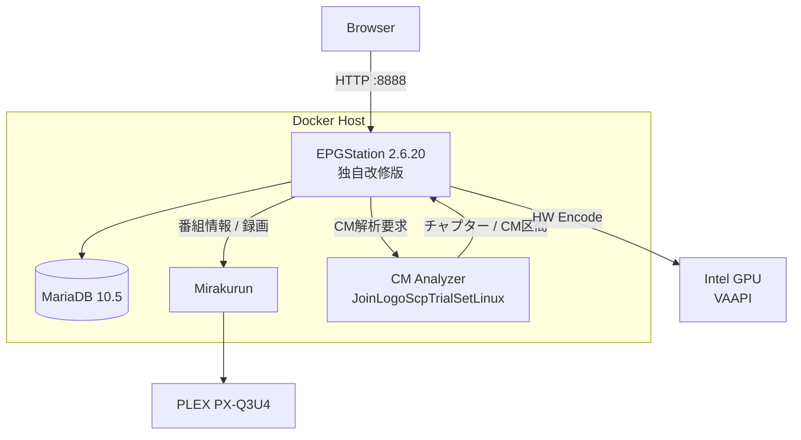
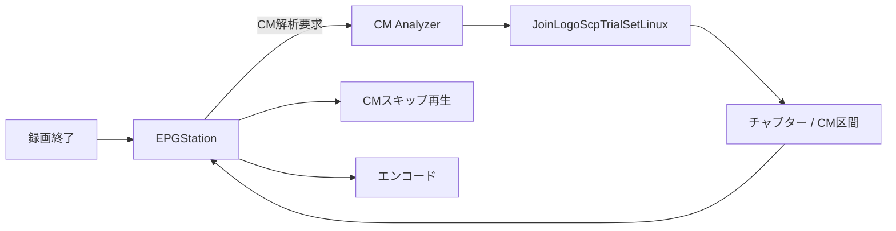
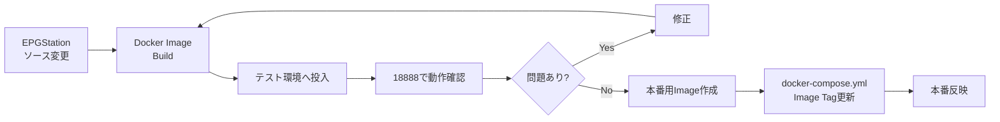

# docker-mirakurun-epgstation

**EPGStation 2.6.20 をベースに独自改修した、自宅録画サーバー用の Mirakurun + EPGStation Docker 環境です。**

本家 EPGStation 2.6.20 のソースコードをベースとしてリポジトリ内で管理・ビルドし、実際の録画サーバーでの運用に合わせて機能追加・改修を行っています。

主な追加・統合機能は、FFmpeg 7.0.2、Intel VAAPI ハードウェアエンコード、TS Repair、CM / チャプター自動解析、CM スキップ、CM 区間を考慮したエンコード、手動チャプター編集、フレームプレビュー、実況コメント取得、本番環境と分離したテスト環境です。

> [!IMPORTANT]
> このリポジトリは EPGStation / Mirakurun の公式配布物ではありません。EPGStation 2.6.20 を基準とした独自派生版であり、本家最新版への自動追従や完全互換を目的としたものではありません。

## ベースバージョン

| Component | Version / Base |
| --- | --- |
| EPGStation | **2.6.20**（独自改修版） |
| FFmpeg | **7.0.2**（ソースビルド + 独自パッチ） |
| Node.js | **16.13.1** |
| MariaDB | **10.5** |
| CM Analyzer | JoinLogoScpTrialSetLinux + 独自パッチ + genlogo |

以降で「EPGStation」と記載している箇所は、特に断りがない限り **EPGStation 2.6.20 ベースの本リポジトリ独自改修版**を指します。

## 主な機能

- Mirakurun によるチューナー管理
- EPGStation 2.6.20 ベースの番組表・予約・録画管理
- MariaDB による EPGStation DB
- FFmpeg 7.0.2
- Intel VAAPI ハードウェアエンコード
- TS タイムライン異常の検出・修復
- JoinLogoScpTrialSetLinux を利用した CM / チャプター解析
- 録画終了後の自動 CM 解析・自動チャプター生成
- CM スキップ再生
- CM 区間を考慮したエンコード
- 手動チャプター編集・フレームプレビュー
- 実況コメント取得
- 本番環境と独立したテスト環境

## 本家からの経緯

もともとは Mirakurun + EPGStation を Docker 上で動かす録画環境として使用していました。

長期間運用する中で、FFmpeg / VAAPI の更新、壊れた TS の救済、CM 自動検出、CM スキップ、CM カットを考慮したエンコード、チャプター編集、実況コメント連携など、設定ファイルや外部スクリプトだけでは収まらない要求が増えました。

そのため現在は EPGStation 2.6.20 のソースコードを `epgstation/source/` に保持し、本体へ独自改修を加えた上で Docker イメージを構築しています。外部の完成済み EPGStation イメージへ依存せず、EPGStation 本体・FFmpeg 7・TS Repair ツールを含めて本リポジトリからビルドする構成です。

## システム構成



Docker Compose では主に `mirakurun`、`mysql-epgstation-v2`、`epgstation`、`cm-analyzer` を動作させます。

## 必要環境

Linux ホストを前提としています。Windows / macOS の Docker Desktop は想定していません。チューナーや `/dev/dri` などの Linux デバイスを直接コンテナへ渡すためです。

### ホスト

- Linux（Debian / Ubuntu 系を想定）
- x86_64 / amd64
- Docker Engine
- Docker Compose v2
- Git
- 4 CPU コア以上推奨
- メモリ 8 GB 以上推奨（ビルドや並列処理を考慮する場合は 16 GB 程度あると余裕があります）
- 録画用の大容量ストレージ
- TS Repair 用の作業領域

### GPU / VAAPI

現在のエンコードおよびストリーミング構成では Intel GPU の VAAPI を利用します。

```bash
ls -l /dev/dri
```

代表的なデバイスは `/dev/dri/card0` と `/dev/dri/renderD128` です。EPGStation コンテナには `/dev/dri` を渡します。

Docker イメージには `i965-va-driver-shaders`、`intel-media-va-driver`、`libva2`、`libva-drm2` を組み込んでいます。GPU 世代によって i965 / iHD の使用状況は異なります。

### ストレージ

現在の Compose には次の実環境用パスがあります。

- 録画: `/media/tv_record`
- TS Repair 作業領域: `/mnt/hdd1/ts-repair-work/epgstation-runtime`

別環境で利用する場合は `docker-compose.yml` / `docker-compose.test.yml` のマウント先を変更してください。

## 動作確認済み環境

現在確認できている主要構成です。OS、CPU、メモリ、GPU 型番などは実機情報を確認後に追記します。

| Item | Environment |
| --- | --- |
| EPGStation | 2.6.20 ベース独自改修版 |
| FFmpeg | 7.0.2 / source build |
| Database | MariaDB 10.5 |
| GPU | Intel GPU / VAAPI |
| VAAPI device | `/dev/dri/renderD128` |
| Tuner | PLEX PX-Q3U4 |
| CM Analyzer | JoinLogoScpTrialSetLinux + patches + genlogo |

## TV チューナー: PLEX PX-Q3U4

動作確認環境では [PLEX PX-Q3U4](https://plex-net.co.jp/item/tv-tuner/px-q3u4/) を使用しています。USB 接続の外付けデジタル TV チューナーで、地上デジタル 4ch + BS/CS 4ch の構成です。

Linux 用の非公式ドライバとして [nns779/px4_drv](https://github.com/nns779/px4_drv) があり、PX-Q3U4 も対応機種に含まれています。

PX-Q3U4 では `/dev/px4video0` ～ `/dev/px4video7` の8デバイスを使用できます。本環境の Mirakurun コンテナにはこれらと `/dev/bus` を渡しています。

> [!NOTE]
> `px4_drv` は非公式 Linux ドライバです。また、ドライバのフォークや Linux カーネルのバージョンによって導入方法・対応状況が異なる場合があります。実際に使用しているドライバのバージョン / フォークは実機確認後に追記します。

別のチューナーを使用する場合は `docker-compose.yml` と Mirakurun のチューナー設定を変更してください。

## ディレクトリ構成

```text
docker-mirakurun-epgstation/
├── docker-compose.yml
├── docker-compose.test.yml
├── mirakurun/
│   ├── config/
│   ├── data/
│   └── docker/
└── epgstation/
    ├── ffmpeg7-ts-repair.Dockerfile
    ├── source/
    ├── config/
    ├── ts-repair/
    ├── patches/
    ├── cm-analyzer/
    └── test-env/
```

## EPGStation イメージのビルド

EPGStation は外部の完成済みイメージではなく、このリポジトリ内のソースコードからビルドします。

```bash
docker build \
  -f epgstation/ffmpeg7-ts-repair.Dockerfile \
  -t epgstation-v2:local \
  epgstation
```

Dockerfile は大きく3段構成です。

1. Debian 11 ベースで FFmpeg 7.0.2、VAAPI パッチ、TS Repair ツールをビルド
2. Node.js 16.13.1 ベースで EPGStation 2.6.20 の Server / Client をビルド
3. Runtime イメージへ EPGStation、FFmpeg 7、VAAPI、TS Repair を統合

## TS Repair

録画 TS のタイムライン異常などを検出・修復する独自ツール群を EPGStation イメージへ組み込んでいます。

主な実行ファイルは `/opt/ffmpeg-7.0.2/bin/` 以下の `ts-repair`、`ts-health-check`、`ts-timeline-remux`、`video-repair`、`audio-repair` です。

## CM Analyzer

CM 解析は EPGStation とは別の Docker コンテナで実行します。JoinLogoScpTrialSetLinux をベースに独自パッチ、CM 解析 API、ロゴ生成処理、`genlogo` を追加しています。



### CM Analyzer のビルド

```bash
docker build \
  -t cm-analyzer:local \
  epgstation/cm-analyzer
```

利用する場合は `docker-compose.yml` のイメージタグもビルドしたタグへ合わせてください。

## 本番環境の起動

環境固有のデバイス・マウント先を確認してから起動します。

```bash
docker compose up -d
```

状態確認:

```bash
docker compose ps
```

ログ:

```bash
docker compose logs -f
```

- EPGStation: `http://<server>:8888/`
- Mirakurun: `http://<server>:40772/`

## テスト環境

本番へ変更を反映する前に確認できるよう、`docker-compose.test.yml` に独立した EPGStation テスト環境を用意しています。

EPGStation、MariaDB、設定・データ、録画ファイル、サムネイル、ログ、CM Analyzer / CM 解析データは本番と分離します。一方、Mirakurun は本番環境を共用します。


### テスト用設定

テスト環境用設定は `epgstation/test-env/config/` 以下に Git 管理されています。`config.yml`、`config.yml.template`、エンコードスクリプト、実況取得スクリプトなどが含まれるため、通常は本番設定をコピーして作成する必要はありません。

テスト用 `config.yml` は Mirakurun を `http://mirakurun:40772/`、DB を `mysql-epgstation-test:3306` として参照します。

### 初回作成

テスト環境は本番と同じ external Docker network を使用するため、まず本番側のネットワーク / Mirakurun が存在することを確認します。

```bash
docker network inspect docker-mirakurun-epgstation_default
```

テスト DB は external volume `epgstation-test-mysql-db` を使用します。初回のみ作成します。

```bash
docker volume create epgstation-test-mysql-db
```

ランタイム用ディレクトリも必要に応じて作成します。

```bash
mkdir -p \
  epgstation/test-env/data \
  epgstation/test-env/recorded \
  epgstation/test-env/thumbnail \
  epgstation/test-env/logs
```

これらの生成データは Git 管理対象外です。

### テスト用イメージのビルド

```bash
docker build \
  -f epgstation/ffmpeg7-ts-repair.Dockerfile \
  -t epgstation-v2:test \
  epgstation
```

### テスト環境の起動

```bash
EPGSTATION_TEST_IMAGE=epgstation-v2:test \
docker compose \
  -f docker-compose.test.yml \
  up -d
```

状態確認:

```bash
docker compose -f docker-compose.test.yml ps
```

テスト EPGStation は `http://<server>:18888/` でアクセスできます。本番の `:8888` と分離されているため同時起動できます。

### テスト環境の停止

```bash
docker compose -f docker-compose.test.yml down
```

通常の `down` では `epgstation-test-mysql-db` は削除されないため、再起動後もテスト DB を継続利用できます。

### テスト DB の初期化

完全に作り直す場合のみ、テスト環境停止後に専用 Volume を削除・再作成します。

```bash
docker compose -f docker-compose.test.yml down
docker volume rm epgstation-test-mysql-db
docker volume create epgstation-test-mysql-db
```

> [!WARNING]
> `epgstation-test-mysql-db` を削除するとテスト DB は失われます。本番 MariaDB の Volume と取り違えないよう注意してください。

## 開発から本番反映まで



開発途中のイメージを直接本番へ投入せず、原則としてテスト環境で確認してから本番へ反映します。

## ストレージとディスク容量

この環境ではディスク容量不足に特に注意してください。録画 TS、エンコード済み動画、TS Repair / CM Analyzer の一時ファイル、Docker image / build cache / overlay2、MariaDB、サムネイル、ログなどが容量を使用します。

```bash
df -h
docker system df
```

特に `/`、`/var/lib/docker`、`/media/tv_record`、`/mnt/hdd1` の空き容量を確認してください。TS Repair では元 TS と同程度、処理内容によってはそれ以上の一時領域が必要になる可能性があります。

> [!WARNING]
> 録画・エンコード・TS Repair 実行中の容量枯渇を避けてください。また `docker system prune` などの一括削除は、削除対象を確認せず実行しないでください。

## 主なベースプロジェクト

- [EPGStation](https://github.com/l3tnun/EPGStation)
- [Mirakurun](https://github.com/Chinachu/Mirakurun)
- [FFmpeg](https://ffmpeg.org/)
- [JoinLogoScpTrialSetLinux](https://github.com/tobitti0/JoinLogoScpTrialSetLinux)
- [px4_drv](https://github.com/nns779/px4_drv)

元プロジェクト由来のコードについては、それぞれのライセンス・著作権に従ってください。

## 注意事項

このリポジトリは特定の実録画環境で使用しながら開発しているものです。チューナー、GPU / VAAPI、デバイスパス、録画保存先、TS Repair 作業領域、Mirakurun チャンネル設定、CM 解析用ロゴなどには環境依存部分があります。

clone してそのまますべての環境で動作する汎用 Docker 構成を目的としたものではありません。利用する環境に合わせて設定を確認・変更してください。
